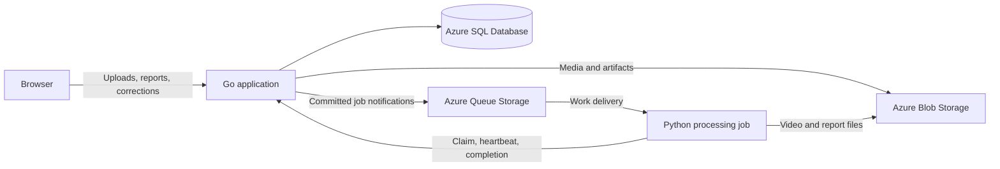

# Architecture

This document describes the proposed system. Services, APIs, and schemas have not yet been implemented.

## Components

The Go application will serve the compiled frontend and own authentication, uploads, run metadata, and job state. The Python worker will decode recordings, classify screens, extract visible fields, and assemble reports. Requests will return a job identifier instead of waiting for video analysis.

The proposed runtime is Go with a SQL Server driver, Python with PyTorch and FFmpeg, and a TypeScript frontend. Local development will use SQL Server Developer and local files or Azurite. Production identities and storage behavior will be verified in Azure.

## Data model

| Record | Contents |
|---|---|
| Run | Owner, source object/hash, duration, layout, status, retention deadline |
| Job | Run, state, attempt, lease token/expiry, worker identity, stage, error |
| Report | Run/job, schema version, immutable result key, pipeline/model hashes |
| Correction | Report version, event/field, original and replacement values, editor, revision |
| Upload reservation | Owner, generated object key, reserved bytes, expiry, completion |
| Outbox item | Job ID, dispatch state, availability time, attempts |

SQL constraints will prevent duplicate authoritative results and conflicting reservations. Corrections will reference an immutable report version; reanalysis will create a new report rather than silently transferring edits to different events.

Report events will contain an ID, type, start/end timestamps, evidence frames, extracted fields, prediction origin, and confidence where available. Timestamps will use media presentation times in integer milliseconds. Unknown fields will be null rather than zero.

Report validation will check schema version, object ownership, size limits, and timestamp bounds before publication.

## Submission and execution

1. An authenticated request creates a run and reserves upload capacity in SQL.
2. Go streams the clip to a generated private Blob key while enforcing the byte limit. Partial uploads are cleaned up on failure.
3. Finalization verifies actual object metadata and creates a job and outbox item in one transaction. Repeated finalization is idempotent.
4. A dispatcher sends the job ID to Queue Storage. An event-triggered worker receives the message and requests a claim for that job.
5. An atomic conditional SQL update assigns a fresh lease token, increments the attempt, and changes the job to running. Only one claimant can succeed.
6. The worker validates the media, processes bounded frame batches, and writes artifacts to an attempt-specific prefix.
7. Completion validates the current lease and report artifacts, then commits the result and terminal job state together.

The initial upload path will enforce size in Go. Direct browser uploads may be added later; a temporary Blob access token alone does not enforce the application's upload-size limit.

## Job lifecycle and recovery

Jobs progress through queued, running, and completed states. Transient failures enter a delayed retry state; invalid inputs fail without repeated execution. Queued or running work can be cancelled.

- A new lease token for every attempt fences out stale workers.
- Heartbeats extend the active SQL lease; queue-message visibility is renewed separately.
- Duplicate notifications for completed jobs are harmless. Messages for an actively leased job are delayed rather than triggering another authoritative execution.
- Queue messages are deleted after a terminal outcome. Repeated failures enter an application-managed poison queue with a sanitized reason.
- Completion retries with the same accepted result are idempotent.
- Cancellation revokes result acceptance and terminates child processing.
- An outbox recovery job resends committed but undispatched jobs and recovers expired leases. Recovery does not depend on the API process staying active.
- Cleanup removes expired uploads and artifacts from abandoned attempts.

Starting defaults are a two-minute lease, 20-second heartbeats, three attempts, and a ten-minute execution timeout for short clips. These settings require validation against measured runtime. Retry counts apply across queue deliveries and container restarts.

## Perception

The pipeline will probe the media, sample timestamped frames, classify screens, group stable segments, read selected fields, and assemble candidate events.

Initial sampling will be approximately 1–2 fps, with denser sampling around detected transitions. Sampling and smoothing will be versioned and evaluated for missed short events.

A visible training menu will establish only that the menu appeared. An inferred action will require supporting transition or result evidence. Original predictions, supporting frames, and user corrections will remain distinguishable.

## Identity and media access

Entra ID and Container Apps authentication will protect private application operations. Go will verify ownership on every run, report, correction, and file request. The browser will not connect directly to SQL.

The application and worker will use separate managed identities with minimum resource permissions. Worker endpoints will authorize a service identity separately from user sessions. Platform identity headers will be trusted only through the configured authenticated ingress.

Media containers will remain private. Authorized playback will use short-lived links. After source retention expires, reports will retain permitted thumbnails and timestamps; local-file reattachment can restore playback after hash/duration verification.

The decoder will run without elevated privileges, with bounded memory, execution time, and temporary storage. Work requests will reference server-issued object keys rather than arbitrary shell commands or remote URLs.

## Verification

API tests will cover ownership isolation, upload caps, idempotency, cancellation, quota reservations, and stale-lease rejection. Worker tests will cover malformed media, presentation timestamps, report validation, and a small real clip.

Integration checks will interrupt an active worker, recover its job, reject its stale completion, and verify that API redeployment preserves results. Frontend checks will cover progress, evidence, correction conflicts, and expired media.

Logs will include job/request IDs, attempts, stage durations, artifact sizes, and pipeline versions. Tokens, signed URLs, and full user data will be excluded. Operational measurements will include queue age, processing failures, latency, memory, and retained bytes.
