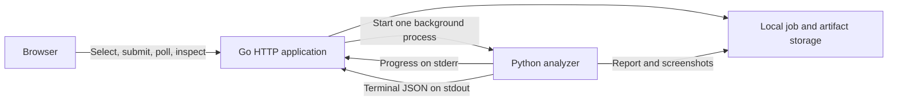

# Milestone: local Go application

## Goal

Run Tracen Replay locally, choose a recording in the browser, start analysis,
follow its progress, and review its turns, changes and source screenshots.
Closing and reopening the application must preserve completed work and clearly
identify interrupted jobs.

This is the next implementation milestone after
[analyzer acceptance](first-go-acceptance.md). This document is the plan;
implementation started on 2026-09-14 with the user's go-ahead while the v35
validation runs (see [go-api-plan.md](go-api-plan.md) for the architecture and
the status). Checked items are implemented and covered by offline tests; the
exit checks that need a real Go-to-Python run are still pending.

## Responsibilities

| Component | Owns |
| --- | --- |
| Go application | HTTP endpoints, recording admission, persistent job metadata, queue, Python process lifecycle, artifact access, browser-facing report queries and frontend delivery |
| Python analyzer | Decoding, sampling, OCR/model inference, screen interpretation, event/action recognition, accounting, report assembly and semantic report validation |
| Browser interface | Recording selection, job progress, turn navigation, readable changes, evidence inspection and display of uncertainty |
| Local storage | Original recordings, per-job metadata, logs, immutable report versions and evidence files |

Go invokes the existing [Python worker command](analysis-job.md). Recognition
and accounting logic stay in Python. Go indexes and presents the validated
report; it must not independently infer actions or rebalance unexplained changes.

## Decisions for this milestone

- Serve one local user on a loopback address. Validate request origin and host;
  do not expose this service on a LAN or the internet as an authenticated app.
- Let the browser select from a configured recordings folder. This avoids
  copying multi-gigabyte recordings and works with the existing full runs.
  Browser uploads are a subsequent feature; the old two-minute/40 MiB hosted
  admission proposal does not restrict this local workflow.
- Use a single Go process and one concurrent analyzer job initially. Bound the
  pending queue and expose the Python OCR worker count through configuration.
  One job at a time is also a memory decision: a full career run peaks near
  17 GB in the single-threaded refinement pass on top of the OCR workers
  (about 1 GB each), so a second concurrent job needs a machine with more than
  32 GB or a worker that streams readings instead of holding them all.
- Keep only the durable outputs of a job: `report.json`, `timeline.json` and
  the worker logs. Invoke the worker with `--prune-frames` so the 11-14 GB of
  sampled and re-read frames are deleted once the report is validated; the
  timeline locates every fact by source timestamp, so a frame can always be
  re-extracted from the recording. Serve the viewer from `timeline.json`
  (under 1 MB) rather than the 150-180 MB report.
- Treat `completed_with_stage_failures` as a completed job with warnings:
  show the failed stages from the envelope, keep the report viewable. Only
  `failed` is a failed job; `report-partial.json`, when present, is its
  diagnostic.
- Persist job metadata using atomic files behind a small storage interface.
  This is adequate for one local process. Azure SQL transactions, distributed
  leases and an outbox belong to the hosted milestone.
- Keep the browser client small: Go serves HTML, CSS and a TypeScript client.
  A client build step is acceptable; a separate frontend server is optional
  during development, not required to use the application.
- Reuse the three accepted report bundles for viewer development. Run real
  short clips to test Go-to-Python execution, and one full recording at final
  integration acceptance. Do not repeat whole-video recognition for UI edits.
- Implement interfaces at actual boundaries: job store, artifact store and
  analyzer runner. Avoid building a generalized plugin or distributed-workflow
  framework before there is a second implementation to support.

## Implementation sequence

### 1. Service foundation and report access

- [x] Organize the Go module, executable, configuration and packages. Revisit
  the unfinished scaffold rather than treating its current structure as fixed.
- [x] Add startup checks for configured directories, Python, FFmpeg and model
  availability, with useful errors and health/readiness endpoints.
- [x] Register existing report/evidence bundles through a local configuration
  or CLI operation. Validate their supported schemas using the Python contract
  before making them available. Registration must not modify the originals.
- [x] Establish confined artifact access. Resolve paths within the owning
  evidence root, reject traversal and escaping symlinks, and return useful
  errors for unavailable artifacts.
- [x] Serve a report summary and its exact original JSON download.

Exit check: Go serves a validated existing report and one of its screenshots;
an unrelated file outside the bundle cannot be retrieved.

### 2. Report viewer

- [x] Add a run list, run summary and turn navigator.
- [x] Show starting/later observed stats and performance currencies, their
  timestamps, committed action, intervening events and transactions.
- [x] Show hint gains, condition changes, energy changes and available race,
  lesson, song and concert details through their existing report records.
- [x] Open source screenshots from an action, change or state observation.
- [x] Present missing observations, ambiguous names, unassigned entries,
  uncertain phase segments and unresolved differences explicitly.
- [x] Index a report once and request turn details as needed. Do not transfer
  the entire OCR-rich report on every page or poll.

Exit check: all three accepted bundles can be explored in the browser without
running Python recognition again. The viewer preserves the limits listed below.
Checked 2026-09-14 in Chrome on the three imported bundles (v1, independent-01,
independent-02): summary, turn navigator, opening states with endpoints and
accounting status, entries with lesson costs and their basis, song/race/concert/
skill-purchase details, non-stat effect text, frame extraction from entry times,
the unassigned view; no console errors at 400 px and 1400 px. Turn buttons,
entry time links and the record toggles are native controls, so keyboard access
follows the document order. The client requests only the summary, the turn list
and one turn at a time; the report JSON is transferred only by the download link.

### 3. Recording submission and worker execution

- [x] List eligible recordings from the configured source folder using
  server-issued source identifiers; requests must not select arbitrary paths.
- [x] Create a durable queued job with its own output directory and attempt
  identity; return its identifier immediately.
- [x] Invoke Python directly with an argument list, without constructing a
  shell command. Keep its working directory and model paths explicit.
- [x] Capture bounded logs and show the latest recognized processing stage.
  Show a percentage only when the worker reports a meaningful numerator and
  denominator; otherwise show the current stage and elapsed time.
- [x] Require exactly one valid terminal worker response. Verify its status,
  report schema, expected artifact location and report hash before accepting
  success. Exit code zero alone is insufficient.
- [x] Make a completed job's report available in the same viewer as imported
  reports. Preserve unknown values and verification flags unchanged.

Exit check: submitting a real short recording starts Python and produces a
viewable report through Go. A fake or mocked worker alone does not pass.
Done 2026-09-14 09:30: a 40-minute recording (creator B) submitted through the
API ran the real analyzer on DirectML with four OCR workers and succeeded in
2580 s with no skipped stage; the report was registered as a job-origin report
and served by the same endpoints and viewer as the imported ones (75 turns,
605 entries). Frames were pruned by the job; 854 MB of OCR caches remain in the
job directory, a retention option to add.

### 4. Cancellation and restart behavior

- [x] Persist the transitions `queued -> running -> succeeded | failed`.
  Support `queued | running -> cancelled` and `running -> interrupted` when
  restarting after an incomplete attempt.
- [x] Resume safely queued work after restart. Never automatically replay an
  interrupted analysis; let the user explicitly submit a new attempt.
- [x] Cancel the entire worker process tree, including OCR subprocesses, on
  Windows and Linux. Do not mark cancellation finished while children continue.
- [x] Ensure shutdown stops admission, records interruption/cancellation and
  releases processes and handles within a bounded time.
- [x] Prevent a late completion from replacing a cancelled or interrupted job.
  New attempts use new output directories and retain earlier reports/logs.
- [x] Preserve completed jobs across restart and reject a damaged or missing
  saved artifact rather than silently displaying it as successful.

Exit check: cancel a real worker, restart with queued/running/completed metadata,
and prove that no duplicate authoritative result or orphan worker is created.
Done 2026-09-14 06:12 with the real analyzer (CPU OCR, a 30-minute recording):
cancel during OCR ended the worker's process tree (interpreter launcher,
interpreter, console host) within seconds and recorded `cancelled` with its
message and a readable worker log; a restart listed the job once and replayed
nothing. A forced kill of the service itself (no shutdown code runs) ended the
worker tree within 15 s because the runner binds every worker to a Windows job
object with kill-on-close, and the next start recorded the job as `interrupted`
with its message. The first attempt of this check found the orphan: before the
job object the tree survived the service's death; the worker also takes
`--owner-pid` now and ends itself when the service is gone, which is the
mechanism on Linux. The orderly Ctrl+C path (admission stops, the running
worker is cancelled, exit within 20 s) is covered by the manager tests.

### 5. Usability and integration acceptance

- [x] Provide one documented startup command after dependency setup, including
  configuration examples that work on Windows without hardcoded user paths
  (`docs/local-app.md`).
- [x] Provide readable input, queue-full, model-missing, worker-failure and
  missing-evidence messages, with a way to inspect the relevant log
  (`docs/local-app.md` lists them; cancelled, interrupted and the worker log
  were exercised with a real worker, the other codes are unit-tested API and
  worker paths).
- [x] Exercise all three report bundles in the browser, including narrow and
  wide layouts and keyboard access to turns/evidence (see the section 2 check).
- [x] Process one complete existing recording through the Go job workflow.
  Compare its produced report with a direct Python invocation using the same
  inputs/options. Distinguish extraction nondeterminism from Go integration
  errors; do not silently accept material changes to recognized records.
  (Creator B through the service versus its direct run: 346 events on both,
  every transaction list, the accounting and the recognized records identical;
  the only difference is the ledger's finale split, which the worker picked up
  from a source edit made during the run. The run is repeated on the sealed
  v39 snapshot so the record has one code identity.)
- [x] Record startup, processing and report-loading measurements. Run Go tests,
  applicable race checks and focused Python contract tests; add these to CI.
  (Startup to ready 0.28 s; a 40-minute recording in 2580 s with four OCR
  workers on the RTX 5060 Ti; report summary 89 ms cold, one turn 13 ms, a
  frame 1.7 s cold and 4 ms cached; `.github/workflows/ci.yml` runs Go vet and
  tests with the race detector on Linux, the client build and the Python suite.)
- [ ] Publish the commands, measured results and remaining limitations.

Exit check: a user can start the application, analyze and inspect a complete
recording, restart the application and still access that report without editing
JSON files or issuing Python commands manually.

### 6. Accounts, uploads and the redesigned client

Added 2026-09-14 on the user's request for a presentable client with sign-in,
per-user runs, uploads, and a recording panel that seeks the video instead of
showing an extracted frame.

- [x] Local accounts (`internal/auth`): PBKDF2-HMAC-SHA256 password hashes,
  HttpOnly session cookie, per-address login limiter; store migration 2 adds
  `users`, `sessions`, `recordings` and the owner columns on jobs and reports.
- [x] Streaming multipart uploads to `<data>/recordings/<user>/` with a size
  limit, extension check and SHA-256 on arrival; per-user listing and
  deletion (refused while an analysis uses the file); jobs and reports are
  scoped to their owner, imported reports stay visible to everyone.
- [x] Video endpoints (`/api/reports/{id}/video`, `/api/recordings/{id}/video`)
  served with range requests from the original file.
- [x] Turn summaries carry the committed action kind, the training option and
  the opening values so the season strip and the stat chart need one request.
- [x] Client rebuilt in Vue: welcome/sign-in, "Your runs" (upload with
  progress, recordings, analyses, reports), the report page
  (season strip, stat chart, year-grouped turn list, opening state, entries
  with orange gains and blue losses, `j`/`k`), the job page, and the recording
  panel that seeks the uploaded video to the picked timestamp with a one-frame
  step and an extracted-frame fallback for reports without a recording.
- [x] Visual language inspired by the game without copying it: white rounded
  cards on a pale striped ground, leaf-green primary with pink and lilac
  accents, the game's stat colours, striped ribbon headers, rounded lettering
  (M PLUS Rounded 1c / Nunito). No game assets.
- [x] Verified in Chrome on a scratch instance: account creation, a 49.5 MB
  upload with progress, an analysis of the upload to a report, and seeking of
  a full 31-minute recording from turns, entries and strip cells.
- [x] Second pass on the user's review ("unintuitive, too vibecoded"): the
  report reads as a replay (final stats with rank letters, one timeline
  scrubber for the career, the recording beside the selected turn, tabs for
  this turn / growth / check); "Your runs" is one list where a run is the
  recording, its analysis and its report on one row with a thumbnail
  (`GET /api/recordings/{id}/frame`). Stat rank letters follow the bands
  read off the game's own badges in the local recordings (documented in
  `docs/local-app.md`, implemented in `web/src/format.ts`).
- [x] Third pass on the user's review: a sheet behind the page content,
  two even columns (recording, turn pane with a fixed-height scrolling log
  and kind filters), the growth chart full width below with click-to-turn,
  a warnings index (`GET /api/reports/{id}/entries`) where every caveat
  links to its turn and moment, and run analytics (choices per turn and
  year, trainings, stat sources, races, shop).
- [x] Fourth pass on the user's review: full-width top bar with a light /
  dark theme toggle (system default), a taller turn pane whose log gets the
  room, performance points on one line, caveats collapsed to three lines,
  stat changes grouped before scenario points in the log, Title Case
  headings, a hover card on the timeline, a hover readout on the growth
  chart, animated stat values, and analytics rebuilt around what a player
  reviews (training efficiency, growth by year, rank milestones, races by
  grade, skill points and skills, hints, rest and energy, events, the
  scenario's economy).
- [x] Fifth pass: a front page with the report components on a made-up
  career, sign-in moved to a card on it and "Your Runs" to `#/runs`; the
  turn pane sized to the recording column (stats under the video, log gets
  the rest), single-root panes so the turn switch animates instead of
  emptying the pane, analytics cards of one height with scrolling bodies,
  growth by year showing the value at each year's end with the gain, rank
  milestones as a table, an original SVG mark and favicon, soft colour
  washes instead of stripes, long names wrapped, and a job's report keeps
  the upload's name.
- [x] Sixth pass: the player has full controls and the turn follows the
  video; performance points carry signed deltas; analytics cards taller
  with fitted tiles, truncating lists and a milestone grid; growth by year
  with the value at each year's end; flat background; the front page cut to
  a headline, screenshots of a real report and one way in.
- [ ] Rebuild the published instance on the current tree once the v39
  validation (five fresh runs, creator C retest) is recorded.

## HTTP surface

Paths may change during implementation, but their responsibilities are fixed.

| Endpoint | Purpose |
| --- | --- |
| `GET /healthz`, `GET /readyz` | Service liveness and readiness to accept analysis |
| `POST /api/jobs` | Queue analysis for a server-issued source identifier |
| `GET /api/jobs`, `GET /api/jobs/{id}` | List jobs or inspect status, stage, elapsed time and result links |
| `POST /api/jobs/{id}/cancel` | Request cancellation with an explicit resulting state |
| `GET /api/reports` | List validated imported and newly generated reports |
| `GET /api/reports/{id}/summary` | Compact run metadata, coverage and uncertainty counts |
| `GET /api/reports/{id}/turns` | Turn navigation without the raw OCR payload |
| `GET /api/reports/{id}/turns/{turnId}` | State observations, entries, comparisons and evidence references |
| `GET /api/reports/{id}/unassigned` | Entries with uncertain turn attribution |
| `GET /api/reports/{id}/download` | Unmodified report JSON |
| `GET /api/reports/{id}/evidence/{path}` | Authorized evidence images within that report's bundle |

Imported reports are resources of their own; they do not need fabricated
successful jobs. Job records link to an immutable report after validated success.

## Viewer correctness requirements

The [turn-ledger contract](turn-ledger.md) is authoritative.
The [analyzer acceptance record](first-go-acceptance.md#observed-coverage)
documents remaining recognition and observation gaps; its fixed-reference
results retain failures. Starting this milestone does not close those issues
or mean that the analyzer is finished.

- Unknown numbers stay unknown. Use `values_ref` to locate observed state
  values and retain `source_ref` and supporting evidence.
- A later observation is not an exact turn boundary. Show its time and basis.
- Browsed training options never count as committed actions or extra rewards.
- A race, lesson or skill transaction may reference the same award as an event;
  do not sum both copies. Count shared resource comparisons once.
- A residual spanning turns belongs to its observed interval. Do not assign it
  to the nearest action merely to make the display look complete.
- Ambiguous hint spellings remain alternatives, not multiple accepted gains.
- Unassigned events remain accessible outside the dated-turn list.
- Final values retain their timestamps. In the third accepted recording, the
  953 SP observation precedes the last unresolved purchase and must not be
  labeled as a post-purchase final balance.
- Job success, full source processing and semantic verification are separate
  statuses. A false legacy `go_ready` flag is not a failed worker execution.

## Test strategy

Use small synthetic job/contract fixtures for scheduling, persistence, malformed
responses and failure tests. Use the accepted report bundles for read-only
viewer checks. Keep private recordings and generated files out of Git.

Required cases include queue limits; concurrent submission; restart during each
job state; cancellation before start and during work; stale completion; malformed
or multiple stdout responses; incorrect report hashes/paths; path traversal and
symlink escapes; absent evidence; and the viewer rules above. Verify actual
process termination and a real Go-to-Python run separately from fake-runner tests.

## Completion boundary and later milestones

The first Go application milestone is complete only when every implementation
checkbox above passes, the full-recording workflow works from the browser, and
its results and remaining limits are documented. Stop there before expanding
scope into another recognition campaign.

Subsequent milestones are browser uploads and input quotas; Azure packaging and
deployment; authentication and per-user ownership; Blob Storage and Azure SQL;
Queue Storage, job leases/outbox and independent workers; and operational
limits, cleanup and cost controls. A separately evaluated ML model, editable
corrections, run comparison and support for more scenarios remain separate
feature work. Local development does not require paid cloud services.
