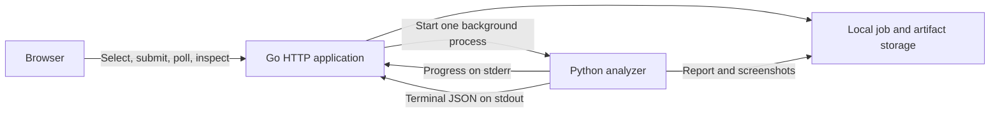

# Milestone: local Go application

## Goal

Run Tracen Replay locally, choose a recording in the browser, start analysis,
follow its progress, and review its turns, changes and source screenshots.
Closing and reopening the application must preserve completed work and clearly
identify interrupted jobs.

This is the next implementation milestone after
[analyzer acceptance](first-go-acceptance.md). This document is the plan;
implementation is paused pending the next instruction. The initial uncommitted
Go scaffold is unfinished and has not passed tests or an end-to-end run. None of
the implementation checklist below is complete yet.

## Responsibilities

| Component | Owns |
| --- | --- |
| Go application | HTTP endpoints, recording admission, persistent job metadata, queue, Python process lifecycle, artifact access, browser-facing report queries and frontend delivery |
| Python analyzer | Decoding, sampling, OCR/model inference, screen interpretation, event/action recognition, accounting, report assembly and semantic report validation |
| Browser interface | Recording selection, job progress, turn navigation, readable changes, evidence inspection and display of uncertainty |
| Local storage | Original recordings, per-job metadata, logs, immutable report versions and evidence files |

Go invokes the existing [Python worker command](analysis-job.md). Recognition
and accounting logic stay in Python. Go indexes and presents the validated
report; it must not independently infer actions or rebalance unexplained changes.

## Decisions for this milestone

- Serve one local user on a loopback address. Validate request origin and host;
  do not expose this service on a LAN or the internet as an authenticated app.
- Let the browser select from a configured recordings folder. This avoids
  copying multi-gigabyte recordings and works with the existing full runs.
  Browser uploads are a subsequent feature; the old two-minute/40 MiB hosted
  admission proposal does not restrict this local workflow.
- Use a single Go process and one concurrent analyzer job initially. Bound the
  pending queue and expose the Python OCR worker count through configuration.
- Persist job metadata using atomic files behind a small storage interface.
  This is adequate for one local process. Azure SQL transactions, distributed
  leases and an outbox belong to the hosted milestone.
- Keep the browser client small: Go serves HTML, CSS and a TypeScript client.
  A client build step is acceptable; a separate frontend server is optional
  during development, not required to use the application.
- Reuse the three accepted report bundles for viewer development. Run real
  short clips to test Go-to-Python execution, and one full recording at final
  integration acceptance. Do not repeat whole-video recognition for UI edits.
- Implement interfaces at actual boundaries: job store, artifact store and
  analyzer runner. Avoid building a generalized plugin or distributed-workflow
  framework before there is a second implementation to support.

## Implementation sequence

### 1. Service foundation and report access

- [ ] Organize the Go module, executable, configuration and packages. Revisit
  the unfinished scaffold rather than treating its current structure as fixed.
- [ ] Add startup checks for configured directories, Python, FFmpeg and model
  availability, with useful errors and health/readiness endpoints.
- [ ] Register existing report/evidence bundles through a local configuration
  or CLI operation. Validate their supported schemas using the Python contract
  before making them available. Registration must not modify the originals.
- [ ] Establish confined artifact access. Resolve paths within the owning
  evidence root, reject traversal and escaping symlinks, and return useful
  errors for unavailable artifacts.
- [ ] Serve a report summary and its exact original JSON download.

Exit check: Go serves a validated existing report and one of its screenshots;
an unrelated file outside the bundle cannot be retrieved.

### 2. Report viewer

- [ ] Add a run list, run summary and turn navigator.
- [ ] Show starting/later observed stats and performance currencies, their
  timestamps, committed action, intervening events and transactions.
- [ ] Show hint gains, condition changes, energy changes and available race,
  lesson, song and concert details through their existing report records.
- [ ] Open source screenshots from an action, change or state observation.
- [ ] Present missing observations, ambiguous names, unassigned entries,
  uncertain phase segments and unresolved differences explicitly.
- [ ] Index a report once and request turn details as needed. Do not transfer
  the entire OCR-rich report on every page or poll.

Exit check: all three accepted bundles can be explored in the browser without
running Python recognition again. The viewer preserves the limits listed below.

### 3. Recording submission and worker execution

- [ ] List eligible recordings from the configured source folder using
  server-issued source identifiers; requests must not select arbitrary paths.
- [ ] Create a durable queued job with its own output directory and attempt
  identity; return its identifier immediately.
- [ ] Invoke Python directly with an argument list, without constructing a
  shell command. Keep its working directory and model paths explicit.
- [ ] Capture bounded logs and show the latest recognized processing stage.
  Show a percentage only when the worker reports a meaningful numerator and
  denominator; otherwise show the current stage and elapsed time.
- [ ] Require exactly one valid terminal worker response. Verify its status,
  report schema, expected artifact location and report hash before accepting
  success. Exit code zero alone is insufficient.
- [ ] Make a completed job's report available in the same viewer as imported
  reports. Preserve unknown values and verification flags unchanged.

Exit check: submitting a real short recording starts Python and produces a
viewable report through Go. A fake or mocked worker alone does not pass.

### 4. Cancellation and restart behavior

- [ ] Persist the transitions `queued -> running -> succeeded | failed`.
  Support `queued | running -> cancelled` and `running -> interrupted` when
  restarting after an incomplete attempt.
- [ ] Resume safely queued work after restart. Never automatically replay an
  interrupted analysis; let the user explicitly submit a new attempt.
- [ ] Cancel the entire worker process tree, including OCR subprocesses, on
  Windows and Linux. Do not mark cancellation finished while children continue.
- [ ] Ensure shutdown stops admission, records interruption/cancellation and
  releases processes and handles within a bounded time.
- [ ] Prevent a late completion from replacing a cancelled or interrupted job.
  New attempts use new output directories and retain earlier reports/logs.
- [ ] Preserve completed jobs across restart and reject a damaged or missing
  saved artifact rather than silently displaying it as successful.

Exit check: cancel a real worker, restart with queued/running/completed metadata,
and prove that no duplicate authoritative result or orphan worker is created.

### 5. Usability and integration acceptance

- [ ] Provide one documented startup command after dependency setup, including
  configuration examples that work on Windows without hardcoded user paths.
- [ ] Provide readable input, queue-full, model-missing, worker-failure and
  missing-evidence messages, with a way to inspect the relevant log.
- [ ] Exercise all three report bundles in the browser, including narrow and
  wide layouts and keyboard access to turns/evidence.
- [ ] Process one complete existing recording through the Go job workflow.
  Compare its produced report with a direct Python invocation using the same
  inputs/options. Distinguish extraction nondeterminism from Go integration
  errors; do not silently accept material changes to recognized records.
- [ ] Record startup, processing and report-loading measurements. Run Go tests,
  applicable race checks and focused Python contract tests; add these to CI.
- [ ] Publish the commands, measured results and remaining limitations.

Exit check: a user can start the application, analyze and inspect a complete
recording, restart the application and still access that report without editing
JSON files or issuing Python commands manually.

## HTTP surface

Paths may change during implementation, but their responsibilities are fixed.

| Endpoint | Purpose |
| --- | --- |
| `GET /healthz`, `GET /readyz` | Service liveness and readiness to accept analysis |
| `GET /api/sources` | Eligible recordings under the configured source folder |
| `POST /api/jobs` | Queue analysis for a server-issued source identifier |
| `GET /api/jobs`, `GET /api/jobs/{id}` | List jobs or inspect status, stage, elapsed time and result links |
| `POST /api/jobs/{id}/cancel` | Request cancellation with an explicit resulting state |
| `GET /api/reports` | List validated imported and newly generated reports |
| `GET /api/reports/{id}/summary` | Compact run metadata, coverage and uncertainty counts |
| `GET /api/reports/{id}/turns` | Turn navigation without the raw OCR payload |
| `GET /api/reports/{id}/turns/{turnId}` | State observations, entries, comparisons and evidence references |
| `GET /api/reports/{id}/unassigned` | Entries with uncertain turn attribution |
| `GET /api/reports/{id}/download` | Unmodified report JSON |
| `GET /api/reports/{id}/evidence/{path}` | Authorized evidence images within that report's bundle |

Imported reports are resources of their own; they do not need fabricated
successful jobs. Job records link to an immutable report after validated success.

## Viewer correctness requirements

The [turn-ledger contract](turn-ledger.md) is authoritative.
The [analyzer acceptance record](first-go-acceptance.md#observed-coverage)
documents remaining recognition and observation gaps; its fixed-reference
results retain failures. Starting this milestone does not close those issues
or mean that the analyzer is finished.

- Unknown numbers stay unknown. Use `values_ref` to locate observed state
  values and retain `source_ref` and supporting evidence.
- A later observation is not an exact turn boundary. Show its time and basis.
- Browsed training options never count as committed actions or extra rewards.
- A race, lesson or skill transaction may reference the same award as an event;
  do not sum both copies. Count shared resource comparisons once.
- A residual spanning turns belongs to its observed interval. Do not assign it
  to the nearest action merely to make the display look complete.
- Ambiguous hint spellings remain alternatives, not multiple accepted gains.
- Unassigned events remain accessible outside the dated-turn list.
- Final values retain their timestamps. In the third accepted recording, the
  953 SP observation precedes the last unresolved purchase and must not be
  labeled as a post-purchase final balance.
- Job success, full source processing and semantic verification are separate
  statuses. A false legacy `go_ready` flag is not a failed worker execution.

## Test strategy

Use small synthetic job/contract fixtures for scheduling, persistence, malformed
responses and failure tests. Use the accepted report bundles for read-only
viewer checks. Keep private recordings and generated files out of Git.

Required cases include queue limits; concurrent submission; restart during each
job state; cancellation before start and during work; stale completion; malformed
or multiple stdout responses; incorrect report hashes/paths; path traversal and
symlink escapes; absent evidence; and the viewer rules above. Verify actual
process termination and a real Go-to-Python run separately from fake-runner tests.

## Completion boundary and later milestones

The first Go application milestone is complete only when every implementation
checkbox above passes, the full-recording workflow works from the browser, and
its results and remaining limits are documented. Stop there before expanding
scope into another recognition campaign.

Subsequent milestones are browser uploads and input quotas; Azure packaging and
deployment; authentication and per-user ownership; Blob Storage and Azure SQL;
Queue Storage, job leases/outbox and independent workers; and operational
limits, cleanup and cost controls. A separately evaluated ML model, editable
corrections, run comparison and support for more scenarios remain separate
feature work. Local development does not require paid cloud services.
